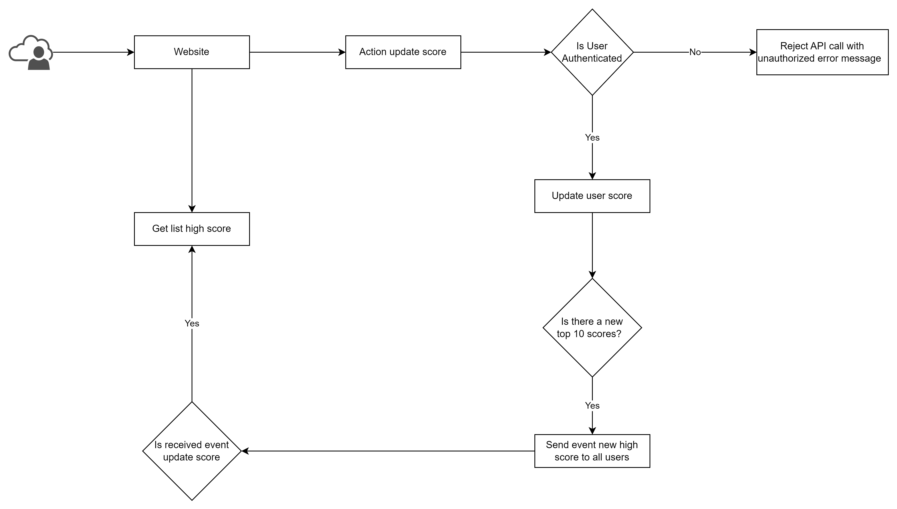

# **API Service Backend Module Specification**

# **Overview**

The API Service Backend Module is responsible for receiving and processing requests to update user scores in real-time on the scoreboard. It ensures the integrity and security of the score update process by implementing authorization checks.

# **Table of Contents**

- [Flow Diagram](https://github.com/thientv98/truong-van-thien-99tech/tree/main/src/problem6#flow-diagram)
- [API Documentation](https://github.com/thientv98/truong-van-thien-99tech/tree/main/src/problem6#api-documentation)
- [Additional Notes](https://github.com/thientv98/truong-van-thien-99tech/tree/main/src/problem6#additional-notes)
- [Conclusion](https://github.com/thientv98/truong-van-thien-99tech/tree/main/src/problem6#conclusion)

# **Flow Diagram**

The following diagram illustrates the flow of execution in the API Service Backend Module:



1. The Client gets the top 10 scores from the application server and listens to the event's new high score.
2. The client sends an action update score
3. The server check is user authenticated. If the user is unauthorized send an error message.
4. If the user is authenticated, increment the score of the user to the database
5. If the new score is a new top 10 score. Send event new high score to users
6. If the user listens event new high score. Get list high score again.

# **API Documentation**

### **Functionality**

The API service module includes the following functionality:

1. Retrieving the top 10 user scores from the score board.
2. Processing user actions to increase the user's score.

The API Service Backend Module provides the following endpoints:

### **Get Top Scores Endpoint**

**Endpoint:** `/api/score/top` 
**Method:** `GET` 
**Response**

- Success: 200 OK

  - Response Body:

  ```json

  {
    "scores": [
      {
        "userId": "1",
        "name": "Bob",
        "email": "bob@example.com",
        "score": 100,
        "avatar": "string"
      },
      {
        "userId": "2",
        "name": "Duo",
        "email": "duo@example.com",
        "score": 90,
        "avatar": "string"
      },
      ...
    ]
  }

  ```

- Error: 500 Internal Server Error
  - Response Body:
  ```json
  {
    "error": "Internal Server Error"
  }
  ```

### **Update Score Endpoint**

**Endpoint:** `/api/score/update` 
**Method:** `POST` 
**Request Body:**

```json
{
  "actionType": "string" // may need an action type to increment the score of the logged in user
}
```

**Response**

- Success: 200 OK
  - No response body
- Error: 401 Unauthorized
  - Response Body:
  ```json
  {
    "error": "Unauthorized"
  }
  ```
- Error: 500 Internal Server Error
  - Response Body:
  ```json
  {
    "error": "Internal Server Error"
  }
  ```

# **Additional Notes**

- The API Service Backend Module should enforce request validation to ensure that the required fields are present and have the correct data types.
- Proper error handling should be implemented to handle exceptional cases and return appropriate response codes and error messages.
- Throttling mechanism should be implemented to prevent abuse and protect the system from excessive requests.

### Security

To prevent unauthorized score updates, the API Service Backend Module integrates with an Authentication Service for authentication and authorization checks. The Authentication Service verifies the credentials of the user making the request and grants or denies access based on the user's authorization level.

Considerations for improving security:

- Implement HTTPS to secure communication between the Client and the API Service Backend Module.
- Implement rate limiting to prevent brute-force attacks or excessive requests.
- Store sensitive user data, such as passwords, in a secure and encrypted manner.
- Implement request validation to ensure that only valid requests are processed.
- Implement logging and monitoring mechanisms to detect and respond to potential security threats.
- Regularly update and patch any third-party libraries or frameworks used in the API Service Backend Module to address security vulnerabilities.

# **Conclusion**

The API Service Backend Module provides the necessary functionality to update and retrieve user scores for real-time display on the score board. By implementing proper security measures and following best practices, the module ensures the integrity and security of the score update process.
